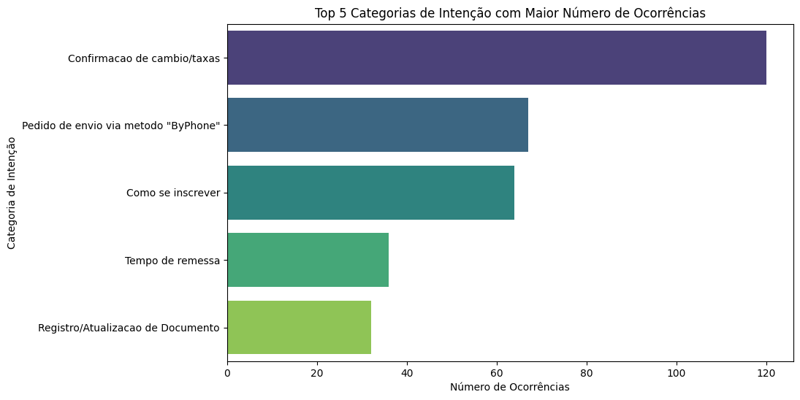
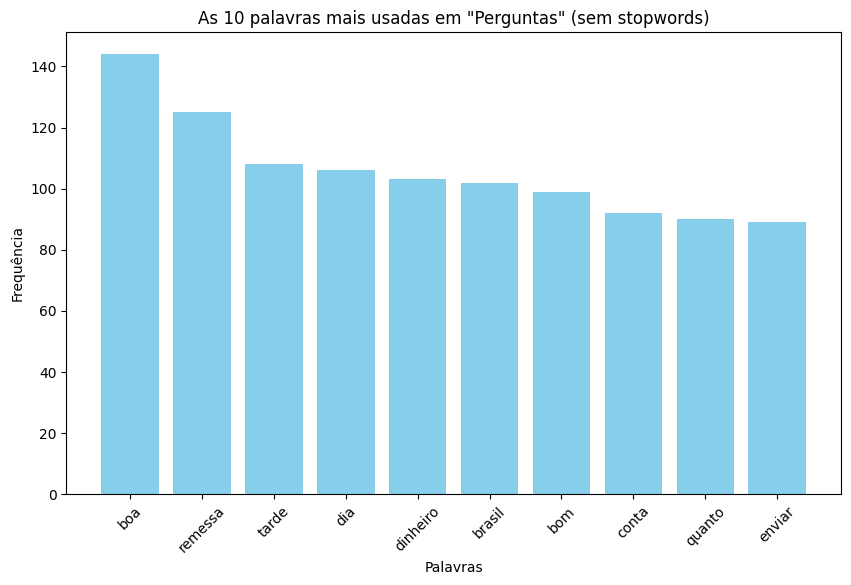
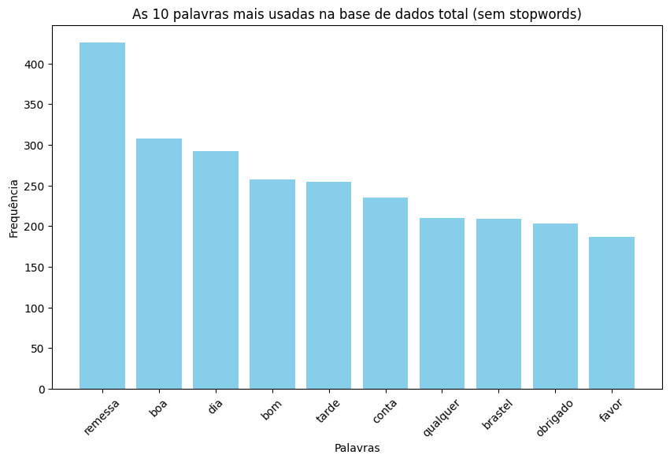
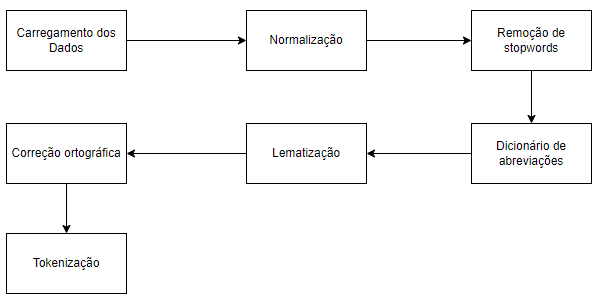
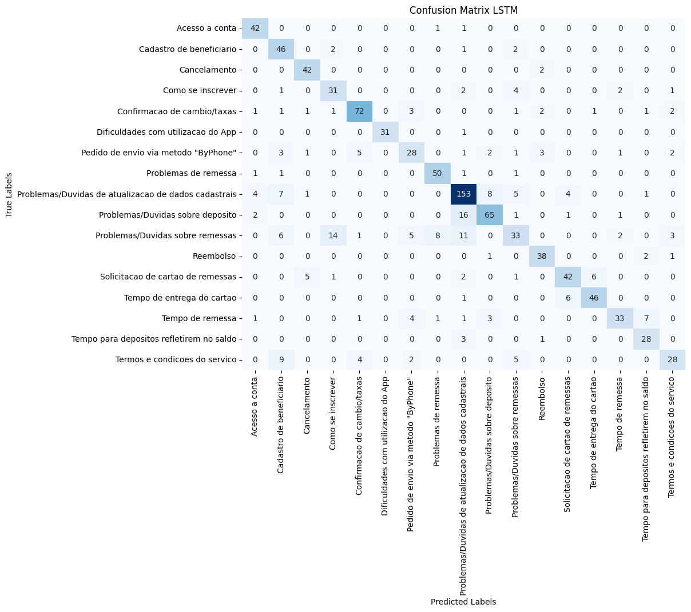
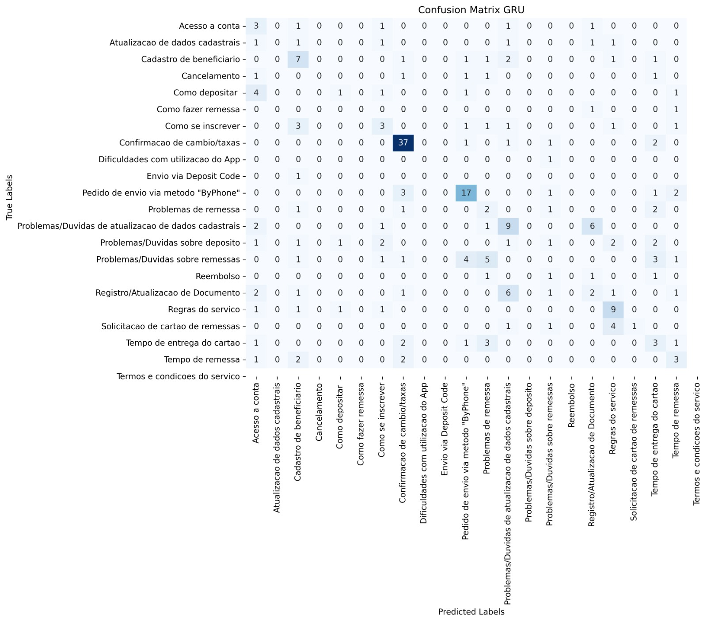
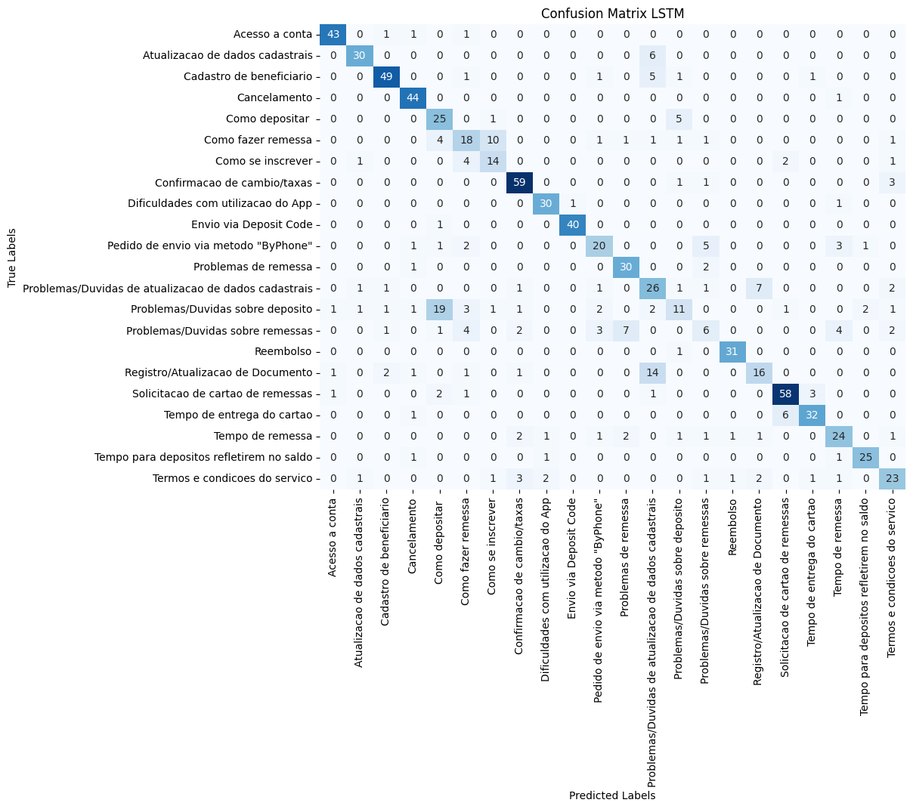

# Sistema de processamento de linguagem natural com IA generativa

## Autores
André Junior, Arthur Reis, Jonas Sales, Luiz Carlos Junior, Luiz Gonçalves, Mateus Silva e Vinicius Santos.

---

**Resumo**

Este artigo descreve o desenvolvimento de um sistema de processamento de linguagem natural (PLN) com IA generativa, focado na automação de atendimento ao cliente por meio de chatbots inteligentes. O objetivo principal é aumentar a eficiência e a escalabilidade no atendimento, permitindo que as empresas lidem com uma alta demanda de interações de forma simultânea e eficiente. Para isso, utilizamos técnicas avançadas de PLN e deep learning que, integradas com modelos de visão computacional, aprimoram o reconhecimento e a resposta às intenções dos usuários. O sistema foi validado com base em sua capacidade de compreender e responder corretamente às demandas de clientes em tempo real, apresentando resultados promissores na otimização do fluxo de atendimento.

**Palavras-chave**: deep learning; IA generativa; chatbots; processamento de linguagem natural.

---

**Abstract**

Este artigo apresenta o desenvolvimento de um sistema de processamento de linguagem natural (PLN) com IA generativa para automatizar o atendimento ao cliente via chatbots. O sistema melhora a eficiência ao gerenciar várias interações simultâneas, utilizando técnicas avançadas de PLN e deep learning. Avaliações iniciais mostram resultados promissores na otimização dos fluxos de atendimento ao cliente.

**Keywords**: deep learning; computer vision; plots; AI; natural language processing.

## 1. Introdução

O acesso às tecnologias digitais está em constante expansão, abrangendo desde os assuntos mais generalizados até os mais específicos. Isso tem levado as empresas a aumentarem sua atenção para a satisfação do cliente em cada interação e experiência que ele tem com a empresa. Como o atendimento humano é limitado a um cliente por vez e pode demorar para solucionar o problema, muitas empresas têm adotado o uso de Chatbots para serviços de atendimento ao cliente (SAC), pois estes podem atender diversas pessoas simultaneamente.

O presente trabalho insere-se nesse contexto, analisando o potencial de um chatbot baseado em técnicas de Processamento de Linguagem Natural (PLN) para lidar com a alta demanda de perguntas e respostas no atendimento ao cliente. O PLN é o ramo da inteligência artificial que atua na interação entre a linguagem humana e a computação, permitindo que o chatbot compreenda e responda às solicitações dos clientes de forma mais natural e precisa. Além disso, o chatbot é capaz de personalizar o atendimento de acordo com a necessidade individual de cada cliente em casos específicos, enquanto atua de forma padronizada em outros, tornando-se uma ferramenta versátil e eficiente.

A Brastel Co. Ltd., uma empresa que oferece serviços financeiros de remessa no Japão, enfrenta o desafio de lidar com uma grande demanda de atendimentos mensais via chat online. Com uma equipe de cerca de 80 pessoas e uma volumetria que se aproxima de 25 mil atendimentos mensais, a implementação de um chatbot baseado em inteligência artificial é uma solução promissora para otimizar o atendimento, oferecendo respostas rápidas e precisas, mesmo em horários de pico. Com o chatbot na linha de frente, os atendentes poderão se concentrar em casos mais complexos que demandam maior interpretação e intervenção humana, enquanto a ferramenta automatiza os processos mais tradicionais. Além dessas vantagens, o chatbot também pode ser utilizado para a coleta de dados importantes sobre a relação com os clientes, auxiliando na identificação de pontos de melhoria e na personalização do atendimento.

## 2. Trabalhos Relacionados

Embora o tema esteja ganhando popularidade nos dias atuais, o processamento de linguagem natural (PLN) é um campo que vem sendo desenvolvido há muito tempo em diversas áreas e com diferentes propósitos. Chatbots para atendimento ao cliente já existem há bastante tempo, embora nem todos sejam desenvolvidos com base em inteligência artificial generativa, o que intensifica ainda mais a popularidade dos chatbots baseados em IA de PLN. A seguir, são mencionados alguns trabalhos relacionados que embasam a pesquisa.

Os modelos de linguagem pré-treinados revolucionaram o campo do Processamento de Linguagem Natural (PLN), cada um com seus pontos fortes e limitações. O GPT-3, com sua arquitetura Transformer Decoder-Only, destaca-se pela capacidade de aprendizado com poucos exemplos (few-shot learning), alcançando resultados de ponta em diversas tarefas, mas pode ter dificuldades em contextos que exigem compreensão bidirecional profunda. O BART, com sua arquitetura encoder-decoder, demonstra bom desempenho em geração de texto, tradução e compreensão de leitura, mas pode ser menos eficaz em cenários de poucos exemplos. O T5, por sua vez, oferece versatilidade e suporte multilíngue, tratando todas as tarefas de PLN como problemas de texto, mas pode não atingir o mesmo nível de desempenho que modelos especializados em tarefas específicas. Em suma, a escolha do modelo ideal depende das necessidades da aplicação, considerando o trade-off entre desempenho, requisitos de dados e recursos computacionais.

### Tabela Trabalhos Relacionados

| Critérios de Comparação | Language Models are Few-Shot Learners | BART: Denoising Sequence-to-Sequence Pre-training for Natural Language Generation, Translation, and Comprehension | T5: Text-To-Text Transfer Transformer |
| --- | --- | --- | --- |
| **Ano de Publicação** | 2020 | 2019 | 2019 |
| **Referência** | Brown, T. B. et al (2020) | Lewis, M. et al (2019) | Raffel, C. et al (2019) |
| **Idioma do modelo** | Inglês (principal) | Inglês (principal) | Multilíngue |
| **Modelo utilizado** | GPT-3 (Transformer Decoder) | BART (Bidirectional Auto-Regressive Transformers) | T5 (Text-To-Text Transfer Transformer) |
| **Precisão da resposta** | Resultados em estado da arte para diversas tarefas de PLN, como tradução, resposta a perguntas e geração de texto, mesmo com poucos exemplos para aprender (few-shot learning) | Bom desempenho em tarefas de geração de texto, tradução automática e compreensão de leitura | Resultados satisfatórios em diversas tarefas de PLN, como tradução automática, resumo e classificação de textos, e resposta a perguntas |
| **Arquitetura do modelo** | Transformer Decoder-Only (apenas decodificador) | Transformer Encoder-Decoder (codificador-decodificador) | Transformer Encoder-Decoder (codificador-decodificador) |
| **Conjunto de Dados de Treinamento** | Treinado com um conjunto de dados de texto diversificado da internet, como Common Crawl, WebText2, Books1 e Books2, e Wikipédia | Pré-treinado em um conjunto de dados de textos da internet e em conjuntos de dados específicos para tarefas como tradução e compreensão de leitura | Pré-treinado em um grande conjunto de dados de texto da internet - C4 (Colossal Clean Crawled Corpus) |
| **Tarefas de PLN** | Geração e resumo de texto, tradução automática, resposta a perguntas, raciocínio e/ou adaptação de domínio, como uso de novas palavras em contexto. | Geração e resumo de texto, tradução automática e compreensão de leitura | Tradução automática, resumo e classificação de texto, resposta a perguntas e tarefas de PLN formuladas como problemas de texto |

Tabela 1: Resumo compacto sobre Trabalhos Relacionados.

 

### Bases bibliográficas consultadas
- Google Scholar (todos os papers da tabela de comparação)
- ArXiv (modelos BART e T5)
- NeuroIPS Proceedings (modelo GPT-3)

### Palavras-Chave para busca
**Palavras-Chave:** GPT-3; T5; BART; Few-shot learning.

## 3. Materiais e Métodos

A execução bem-sucedida de um projeto de chatbot exige um escopo bem definido, com ferramentas selecionadas para o problema em questão e um fluxo de trabalho que incorpore questionamento, análise, exploração, processamento, modelagem e refinamento de dados e modelos de IA. Nesta seção, são abordados os materiais e métodos utilizados no projeto.

### 3.1 Materiais

Para a criação do chatbot, são necessárias diversas ferramentas para integração de dados, treino de modelo e organização do trabalho de maneira ágil e eficiente. O ambiente de desenvolvimento Google Colaboratory (Colab), em conjunto com a linguagem de programação Python e bibliotecas auxiliares, foi utilizado para extrair informações e agrupá-las conforme as necessidades da equipe. A seguir, são listadas as bibliotecas utilizadas e suas funcionalidades de maneira resumida:

- **Google Colaboratory**: Ambiente de desenvolvimento em nuvem que permite a execução de códigos Python em notebooks Jupyter.
- **Python (versão 3.10.12)**: Linguagem de programação de alto nível, utilizada para manipulação de dados, treinamento de modelos e criação de chatbots[9](#referencia-9).
- **NumPy (versão 1.26.4)**: Biblioteca para manipulação de arrays e auxílio em modelos matemáticos complexos[10](#referencia-10).
- **Pandas (versão 2.1.4)**: Biblioteca para carregamento de dados em formato de dataframe, facilitando a manipulação e extração de informações[11](#referencia-11).
- **Matplotlib (versão 3.7.1)**: Biblioteca para criação de gráficos, auxiliando na visualização e compreensão dos dados[12](#referencia-12).
- **NLTK (versão 3.8.1)**: Toolkit para modelos de linguagem natural, com funções de tokenização, lematização, entre outras[13](#referencia-13).
- **SpaCY (versão 3.7.6)**: Conjunto de ferramentas de linguagem natural, utilizado para checagem de output com teste de validação do pré-processamento[14](#referencia-14).
- **RegEx (re) (versão 2.2.1)**: Biblioteca embutida do Python para criação de expressões regulares, permitindo identificar, remover, substituir e adicionar caracteres nos dados.[15](#referencia-15)
- **Seaborn (versão 0.13.1)**: Biblioteca de visualização de dados baseada em Matplotlib, com gráficos mais complexos e detalhados.
- **Counter**: Ferramenta para contar ocorrências de palavras em um texto[16](#referencia-16).
- **Word2Number (versão 1.1)**: Biblioteca para conversão de palavras para números, facilitando a interpretação de mensagens com valores escritos por extenso[17](#referencia-17).
- **HunsSpell (versão 0.5.5)**: Corretor ortográfico para identificar e corrigir erros de digitação em palavras[18](#referencia-18).
- **Word2Vec (versão 4.3.3)**: Modelo de aprendizado de máquina para processamento de linguagem natural, utilizado para treinar o modelo de chatbot[19](#referencia-19).
- **Naive Bayes (versão 1.3.2)**: Algoritmo de classificação probabilístico baseado no teorema de Bayes, utilizado para classificar as mensagens em categorias de intenção[20](#referencia-20).
- **Keras (2.17.0)**: Biblioteca de redes neurais de alto nível, utilizada para a criação de modelos de chatbot[21](#referencia-21).
- **TensorFlow (versão 2.17.0)**: Biblioteca de código aberto para aprendizado de máquina e desenvolvimento de modelos de chatbot[22](#referencia-22).
- **Time (versão 3.10.12)**: Biblioteca embutida do Python para manipulação de datas e horários e contagem de tempo de execução de códigos[23](#referencia-23).
- **PSutil (versão 5.9.5)**: Biblioteca para monitoramento de recursos do sistema, como CPU, memória, disco e rede[24](#referencia-24).
- **SKLearn (versão 1.3.2)**: Biblioteca de aprendizado de máquina para classificação, regressão e clustering de dados, além de pré-processamento e seleção de modelos[25](#referencia-25).
- **Gensim (versão 4.3.3)**: Biblioteca para modelagem de tópicos e processamento de linguagem natural, utilizada para treinar o modelo de chatbot[26](#referencia-26).
- **Llama-3.2-3B**: Modelo de geração de texto utilizado para gerar respostas baseadas em intenções e perguntas. O modelo foi ajustado usando a técnica *LoRA* (Low-Rank Adaptation), que permite treinar uma pequena parte dos parâmetros, otimizando o uso de recursos computacionais.
- **LoRA (Low-Rank Adaptation)**: Técnica de adaptação que otimiza o ajuste de grandes modelos de linguagem sem necessidade de ajuste completo, reduzindo o consumo de memória e aumentando a eficiência.
- **Unsloth**: Biblioteca que facilita a integração e manipulação de grandes modelos de linguagem, como o Llama-3.2, com suporte para quantização de baixa precisão (como 4-bit), possibilitando o uso mais eficiente de recursos computacionais durante o treinamento e a inferência.
- **BERT embeddings**: Utilizados para comparar a similaridade semântica entre as respostas geradas pelo modelo e as respostas reais, garantindo que as respostas preditas estejam alinhadas com o contexto do usuário.

Essas ferramentas e bibliotecas proporcionaram uma infraestrutura robusta para o desenvolvimento e treinamento do modelo de chatbot, integrando eficientemente os processos de análise de linguagem natural (NLU) e geração de respostas (NLG).

### 3.2 Métodos

Os métodos englobam as etapas do processo desde o início até o fim do escopo do projeto. Primeiramente, os dados passam por uma análise exploratória inicial, com o objetivo de esclarecer dúvidas e abrir o campo de ideias do time de desenvolvimento. Depois, o pré-processamento refina as informações para que possam ser alimentadas ao chatbot, que, após treinado, é testado em diferentes circunstâncias para verificar sua eficácia em responder perguntas com base em cenários realistas do cotidiano.

#### 3.2.1 Dados fornecidos

As mensagens usadas no modelo são disponibilizadas via arquivo .csv (Comma Separated Value) em um Drive compartilhado pela equipe. A tabela é dividida em "No" (número), Intenção, Pergunta e Resposta.

- **No**: Identificador Único em números naturais.
- **Intenção**: Motivações por trás de cada pergunta enviada pelos clientes, com 18 intenções identificadas.
- **Pergunta**: Mensagem enviada pelo usuário que inicia a conversa.
- **Resposta**: Retorno enviado pela entidade que recebeu a pergunta.

#### 3.2.2 Análise e exploração

Após o carregamento dos dados, uma série de perguntas é feita sobre como os dados estão dispostos, suas características únicas e quais informações podem ser extraídas inicialmente, antes de qualquer manipulação ou alteração. Esta etapa visa trazer insights sobre a distribuição dos dados e quais peculiaridades devem ser consideradas.

##### 3.2.2.1 Perguntas respondidas em tabela

| Perguntas                                                                             | Respostas                          |
|---------------------------------------------------------------------------------------|------------------------------------|
| Quantas mensagens possuem palavras japonesas?                                         | 3                                  |
| Quantas categorias de intenção existem?                                               | 18                                 |
| Quantas mensagens estão relacionadas a "depósito", "inscrição", "cartão" e "remessa"? | 70, 105, 102, 295, respectivamente |
| Quantas palavras relacionadas a "app" ou "aplicativo" aparecem nas mensagens?         | 24, 180, respectivamente           |
| Quantas perguntas e respostas são duplicadas?                                         | 68, 87, respctivamente             |
| Quantas perguntas são feitas sobre conversão e taxas?                                 | 149                                |
| Quantas mensagens mencionam "erro" ou "problema"?                                     | 14                                 |
| Quantas mensagens falam sobre "limites de transferência/depósito/remessa"?            | 13                                 |
| Quantas mensagens mencionam o tempo do valor chegar ao beneficiário?                  | 29                                 |
| Quantas mensagens incluem perguntas sobre horário de funcionamento?                   | 1                                  |
| Quantas perguntas são sobre confirmação de pagamento?                                 | 9                                  |
| Quantas perguntas possuem links externos (URLs)?                                      | 0                                  |
| Quantas abreviações existem na base de dados?                                         | 1074                               |

Tabela 2: Perguntas feitas na Análise e Exploração.

 

#### 3.2.2.2 Intenções de maior ocorrência

Saber quais intenções são as mais prevalentes é de alta prioridade, pois se torna claro o quão balanceados os dados estão em relação às dúvidas e perguntas. A Figura 1 mostra uma desproporcionalidade de intenções, pois a confirmação de câmbio e taxas é de 120, quase o dobro de outras intenções, como a de Pedido de envio via método "ByPhone".

Figura 1: Top 5 Categorias de Intenção com Maior Número de Ocorrências.

 

#### 3.2.2.3 As 10 palavras mais usadas em "Perguntas" (sem stopwords)

A diversidade no vocabulário nas perguntas pode guiar a equipe de desenvolvimento em quais são as palavras-chave mais utilizadas e quais as relações entre elas. A Figura 2 mostra que palavras de saudação são as mais comuns, embora não sejam de grande importância para o chatbot alcançar o tópico principal das mensagens.

Figura 2: As 10 palavras mais usadas em "Perguntas" (sem stopwords).

 

#### 3.2.2.4 As 10 palavras mais usadas na base de dados total (sem stopwords)

Em conjunto com a [Figura 2](#figura-2) e englobando também as respostas, é perceptível que a palavra-chave principal é "remessa". Isso traz a conscientização de que assuntos relacionados à "remessa" serão prioritários para o chatbot.

Figura 3: As 10 palavras mais usadas na base de dados total (sem stopwords).

 

### 3.2.3 Pré-Processamento

É crucial que, antes de qualquer treino com o modelo de IA, os dados passem por uma profunda manipulação para simplificação e para que se adequem aos moldes de interpretação do chatbot. Caracteres especiais, números, erros de ortografia e outros casos similares podem causar confusão ao modelo, incapacitando-o de gerar texto que responda com precisão à pergunta que lhe foi dada.

#### 3.2.3.1 Fluxograma de funcionamento

A Figura 4 representa o funcionamento lógico da pipeline e o pré-processamento presente no Jupyter Notebook. A pipeline é composta por diferentes partes, desde o carregamento em dataframe utilizando Pandas até processamentos mais profundos, sendo estes:

Figura 4: Fluxograma de funcionamento da pipeline de pré-processamento.

 

#### 3.2.3.2 Normalização e remoção de dados desnecessários

Remove os espaços em excesso, converte o texto em uma frase de uma linha, normaliza o texto para que fique todo com letras minúsculas, remove as pontuações, números, símbolos, caracteres especiais e emojis, links e endereços de e-mail.

#### 3.2.3.3 Remoção de stopwords

Remove as "palavras de parada", que são os artigos, pronomes e palavras usadas com muita frequência e acabam tendo pouco significado no texto e, em alguns casos, se tornando irrelevantes.

#### 3.2.3.4 Dicionário das abreviações encontradas na base de dados e aplicação

Foi feita uma análise das principais abreviações que apareciam no dataframe e, com base nisso, criado um dicionário que é usado para substituir cada abreviação por sua palavra por extenso através de um loop que percorre as principais colunas que estamos usando.

#### 3.2.3.5 Correção ortográfica do conjunto de dados

Foi utilizado o corretor ortográfico Hunspell para corrigir erros de digitação em palavras, garantindo que o texto esteja correto e sem erros que possam atrapalhar a interpretação do modelo.

#### 3.2.3.6 Lematização

Foi feita a lematização das palavras, que é o processo de reduzir as palavras flexionadas adequadamente para sua forma base ou raiz, o que facilita a análise e a compreensão do texto, utilizando a biblioteca SpaCY.

#### 3.2.3.7 Tokenização

Após a limpeza e a conversão das abreviações, é feita a tokenização das frases, convertendo-as em palavras individuais, o que facilita o processo de generalização e a conversão realizada no próximo passo de pré-processamento.

### 3.3 Modelos de Rede Neural para Processamento de Texto
O primeiro passo para a criação de um chatbot é a escolha do modelo de rede neural que será utilizado para processar o texto. Nesta etapa, foram criados três modelos distintos, todos utilizando uma camada de embedding para transformar as palavras em vetores densos e de alta dimensão, permitindo que a rede entenda o contexto das palavras. Para cada modelo, foi utilizada uma abordagem diferente de rede neural: uma RNN, um LSTM e um GRU, implementados com as bibliotecas Keras e TensorFlow.

#### 3.3.1 Modelo com Embedding e RNN
O primeiro modelo foi baseado em uma Rede Neural Recorrente (RNN), ideal para processar sequências de dados, como textos. O modelo começou com uma camada de embedding para representar as palavras em um espaço vetorial denso, seguido por uma camada RNN que processa as sequências de palavras. A RNN foi responsável por captar dependências temporais curtas no texto, sendo útil para problemas em que o contexto imediato das palavras é importante. Adicionalmente, camadas de dropout e densa foram incluídas para evitar overfitting e garantir a robustez do modelo. A camada de saída utilizou ativação softmax para classificar as intenções do chatbot.

#### 3.3.2 Modelo com Embedding e LSTM
O segundo modelo utilizou uma camada de LSTM (Long Short-Term Memory), uma variação da RNN, que foi projetada para capturar dependências temporais mais longas em sequências de dados. Assim como no modelo anterior, a rede iniciou-se com uma camada de embedding, seguida por uma camada LSTM que processa o texto de forma mais eficiente ao lidar com longas dependências e informações contextuais mais distantes. A LSTM foi complementada por camadas de dropout e densas, com a saída final ativada por softmax.

#### 3.3.3 Modelo com Embedding e GRU
O terceiro modelo implementado utilizou a arquitetura GRU (Gated Recurrent Unit), uma versão simplificada da LSTM, que também é capaz de capturar dependências temporais de forma eficiente, mas com menor complexidade computacional. Após a camada de embedding, a camada GRU processou as sequências de texto, garantindo uma boa performance na retenção de informações sem o custo computacional elevado da LSTM. Assim como nos outros modelos, foram adicionadas camadas de dropout e densas, com a saída ativada por softmax.

#### 3.3.4 Modelo de Geração de Linguagem Natural (NLG)

O modelo de Geração de Linguagem Natural (NLG) foi desenvolvido com base no Llama Language Model, uma arquitetura de rede neural generativa (GNN) que utiliza um modelo de linguagem pré-treinado. Para o caso do grupo, foi utilizada a versão Llama 3B, que possui 3 milhões de parâmetros e foi treinado para gerar as respostas do chatbot com base nas intenções identificadas pelo modelo de classificação de intenções. O modelo NLG foi treinado com um conjunto de dados de perguntas e respostas, com o objetivo de gerar respostas coerentes e contextualizadas com as perguntas dos usuários.

### 3.4 Métricas

No processo de escolha da métrica para avaliação de desempenho de modelos de aprendizado de máquina, foi escolhida a acurácia em detrimento de outras métricas, como recall, F1 score e precisão. A acurácia é uma métrica de avaliação de modelos de aprendizado de máquina que mede a proporção de previsões corretas em relação ao total de previsões realizadas. Ela é calculada dividindo o número de classificações corretas (tanto positivos quanto negativos) pelo número total de amostras [22](referencia-27).

### 3.5 Modelo de Rede Neural para Geração de Texto

Para a criação de um sistema de geração de linguagem natural (NLG) eficiente, foi utilizado o modelo pré-treinado *Llama-3.2-3B-Instruct, ajustado com a técnica LoRA* (Low-Rank Adaptation), que permite a adaptação de modelos de grande porte de forma mais leve e eficiente. Essa técnica permite treinar apenas uma pequena parte dos parâmetros do modelo, otimizando o consumo de recursos computacionais sem perder a qualidade nas respostas geradas.

A escolha do modelo Llama foi motivada por sua capacidade de lidar com tarefas de conversação e geração de texto de maneira eficaz, respondendo com precisão e contexto relevante, alinhado com o objetivo de construir um chatbot que atenda às necessidades dos usuários. Além disso, a utilização de um modelo pré-treinado permitiu reduzir o tempo de treinamento, uma vez que a maior parte do conhecimento sobre linguagem já estava embutida no modelo.

O fluxo de trabalho para o treinamento incluiu o ajuste supervisionado do modelo com base em dados reais de perguntas e respostas, estruturadas de forma conversacional. Utilizamos o método de *Supervised Fine-Tuning (SFT)*, que consiste em ajustar o modelo com exemplos específicos do domínio de atendimento ao cliente, incluindo intenções e perguntas, e avaliamos a qualidade das respostas geradas por meio de similaridade de coseno com respostas reais.

Após o ajuste fino, o modelo foi avaliado utilizando *BERT embeddings* para medir a similaridade entre as respostas geradas e as respostas reais, garantindo que o modelo fosse capaz de capturar o contexto e gerar respostas adequadas.

### 3.6 Métricas NLG

Para avaliar a qualidade das respostas geradas pelo modelo de linguagem natural, utilizamos a métrica de *similaridade de coseno* entre as respostas geradas e as respostas reais. A similaridade de coseno foi calculada com base em embeddings gerados pelo modelo *BERT*, permitindo uma comparação semântica das respostas.

A similaridade de coseno é uma métrica eficaz para medir a semelhança entre dois vetores em um espaço vetorial, sendo amplamente utilizada para avaliar a qualidade de textos gerados em tarefas de NLG. No contexto do projeto, essa métrica ajudou a verificar o quão próximas semanticamente as respostas geradas pelo modelo estavam das respostas reais fornecidas pelos atendentes.

Além disso, foram criados gráficos de *distribuição de similaridade* para visualizar a performance do modelo em diferentes cenários de intenção, assim como *heatmaps* para avaliar a média de similaridade por intenção. Essa análise permitiu identificar quais intenções estavam mais bem representadas no modelo e quais ainda necessitavam de ajustes.

### 3.5 Data Augmentation

O Data Augmentation (Aumento de Dados) é uma estratégia no processamento de linguagem natural que visa aumentar a quantidade de dados disponíveis para o treinamento de modelos, sem a necessidade de coletar novos dados. No contexto deste projeto buscando o equilíbrio entre as classes de intenção, contribuindo também para a generalização do modelo.

Para a aplicação do projeto foram utilizadas três técnicas. A primeira técnica, conhecida como tradução para trás [23](#referencia-28), ajuda a gerar variações linguísticas mantendo o significado original, melhorando a assertividade do modelo quando o usuário utilizar expressões diferentes. Em seguida, a busca por sinônimos [23](#referencia-28), permitindo que o modelo reconheça e processe palavras com significados semelhantes de forma mais eficaz. Por fim, a inversão da ordem das palavras [23](#referencia-28) nas sentenças introduz variações estruturais que podem ajudar o modelo a compreender erros gramaticais.

## 4. Resultados 

Os resultados obtidos são apresentados em duas etapas: a primeira parte refere-se ao Processamento de Linguagem Natural (PLN) e NLU (Natural Language Understanding) e a segunda parte aborda a Natural Language Generation (NLG). Cada etapa é avaliada com base em métricas específicas, como acurácia, matriz de confusão e tempo de execução, permitindo uma análise detalhada do desempenho dos modelos.

### 4.1 NLU 

Após o treinamento do modelo com os dados pré-processados e com os modelos embedding com arquiteturas de redes neurais, avaliamos sua eficácia em predizer as verdadeiras intenções por trás de perguntas. Saber a quantidade de verdadeiros positivos e falsos negativos é crucial para a etapa de geração de texto, pois as respostas da inteligência artificial devem combinar com as perguntas, mitigando alucinações.

#### 4.1.1 Métricas de Avaliação

A principal métrica de avaliação da eficácia do modelo é a Acurácia, que é a soma de verdadeiros positivos e verdadeiros negativos dividida pela quantidade total de predições realizadas. A Tabela 3 mostra a acurácia de cada modelo.

| **Modelo** | **Acurácia** |
|------------|-------------------|
| **RNN**    | 71.00%            |
| **LSTM**   | 78.00%            |
| **GRU**    | 41.00%            |

Tabela 3: Acurácia das abordagens PLN.

 

##### 4.1.1.1 Mudança com aumento de dados
Com o processo do aumento de dados, foi possível balancear melhor as intenções e realizar novos testes. Esse teste foi realizado especificamente com o LSTM e a tabela 4 apresenta os novos resultados obtidos.

| **Modelo** | **Acurácia** |
|------------|-------------------|
| **LSTM**   | 78.00%            |

Tabela 4: Acurácia do modelo LSTM após aumento de dados.

 

#### 4.1.2 Matriz de Confusão

A Matriz de Confusão mostra, de maneira quantitativa, a precisão dos acertos do modelo em todas as labels. Por meio dessa matriz, é possível identificar possíveis vieses, com base nas labels em que o modelo acertou precisamente as verdadeiras intenções e naquelas em que apresentou vários falsos positivos.

Figura 5: Matriz de Confusão da abordagem PLN Word2Vec + RNN.

 

Figura 6: Matriz de Confusão da abordagem PLN LSTM.

 

Figura 7: Matriz de Confusão da abordagem PLN GRU.

 

##### 4.1.2.1 Matriz de Confusão com aumento de dados

A matriz de confusão após o aumento dos dados mostra uma distribuição mais equilibrada das intenções, dado que o aumento dos dados visava balancear as intenções. A Figura 8 apresenta a nova matriz de confusão do modelo LSTM após o processo de aumento e balanceamento dos dados e junção de algumas labels.

Figura 8: Matriz de Confusão da abordagem PLN LSTM após aumento de dados.

 

#### 4.1.3 Tabela dos Resultados com GPU e CPU

A comparação do treino de modelos em GPU e CPU mostra em quais arquiteturas computacionais o modelo é capaz de trabalhar com mais eficiência, assim como quais recursos são alocados e utilizados.

| **Modelo**                  | **Tipo de Processador** | **Tempo de Treinamento** | **Uso de Memória (MB)** |
|-----------------------------|-------------------------|--------------------------|-------------------------|
| Word2Vec + Rede Neural RNN  | T4 GPU                  | 74.32 segundos   | 4939.39 MB     |
| Word2Vec + Rede Neural RNN  | CPU                     | 20 minutos e 25 segundos |1019.34 MB |
| LSTM | T4 GPU                  | 7 minutos e 19 segundos            | 1429.45 MB |
| LSTM | CPU                  | 11 minutos e 33 segundos          | 938.43 MB |
| GRU | T4 GPU                  | 10 minutos e 57 segundos | 1037.48 MB   |
| GRU | CPU                     | 11 minutos e 16 segundos | 1526.52 MB   |

Tabela 5: Tempo de execução de cada modelo comparando CPU e GPU.

 

#### 4.1.4 Tabela dos Resultados com GPU e CPU após aumento de dados

A comparação foi feita entre o modelo LSTM com e sem aumento de dados, comparando o tempo de treinamento e o uso de memória em CPU e GPU, como é possível visualizar na Tabela 6.

| **Modelo**                  | **Tipo de Processador** | **Tempo de Treinamento** | **Uso de Memória (MB)** |
|-----------------------------|-------------------------|--------------------------|-------------------------|
| LSTM | T4 GPU                  | 21 minutos e 48 segundos            | 1429.45 MB |
| LSTM | CPU                  | 26 minutos e 23 segundos          | 882.40 MB |

Tabela 6: Tempo de execução do modelo LSTM comparando CPU e GPU após aumento de dados.

 

### 4.2 NLG

Para a etapa de Geração de Linguagem Natural (NLG), utilizamos o modelo pré-treinado T5 (Text-to-Text Transfer Transformer), que se mostrou eficaz em tarefas de geração de texto ao ser ajustado para nosso conjunto de dados específico. O T5 é um modelo que adota a abordagem "Text-to-Text", onde tanto a entrada quanto a saída são tratadas como texto. Isso facilita a adaptação a diferentes tarefas de Processamento de Linguagem Natural (PLN), incluindo tradução, resumo e, no nosso caso, a geração de respostas automatizadas com base nas intenções detectadas pelo modelo de NLU. O T5 foi treinado em um grande corpus de texto, o que contribui para sua capacidade de entender e gerar respostas em diferentes contextos.

#### 4.2.1 Notebook 1 ( T4 GPU)

**Especificações do Ambiente de Teste:**
- **Modelo de GPU:** NVIDIA Tesla T4
- **Memória da GPU:** 16 GB
- **Sistema Operacional:** Ubuntu 22.04.3 LTS
- **Versão do TensorFlow:** 2.8.0
- **Versão do T5:**  4.44.2

##### 4.2.1.1 Sem Data Augmentation

Neste caso, o modelo foi treinado sem a utilização de técnicas de Data Augmentation, que são geralmente empregadas para aumentar a diversidade do conjunto de dados e, assim, melhorar a generalização do modelo.

###### 4.2.1.1.1 Resultado de Geração de Resposta

A pergunta "Como fazer remessa?" gerou a seguinte resposta:
> "ol como fazer remessa"

###### 4.2.1.1.2 Tabela de Resultados de Inferência

| **Métrica**                  | **Valor**                |
|------------------------------|--------------------------|
| **Perda de Avaliação (Eval Loss)**  | 0.385                |
| **Tempo de Avaliação (Runtime)**    | 5.267 segundos         |
| **Amostras por Segundo**            | 29.43                |
| **Passos por Segundo**              | 3.797                 |
| **Épocas**                          | 3.0                  |

*Tabela 7: Resultados das métricas de avaliação do modelo T5 (Sem Data Augmentation).*

- **Eval Loss:** A perda de avaliação mede a diferença entre as previsões do modelo e as respostas reais. Um valor mais baixo indica um melhor desempenho do modelo, sugerindo que as respostas geradas estão mais alinhadas com as expectativas.
- **Tempo de Avaliação:** Tempo necessário para realizar a avaliação do modelo em relação ao conjunto de validação, importante para entender a eficiência do modelo em ambientes de produção.
- **Amostras por Segundo:** Refere-se à quantidade de amostras processadas pelo modelo em um segundo, uma medida da eficiência do modelo.
- **Passos por Segundo:** Indica quantos passos de treinamento são realizados em um segundo, relevante para avaliar a velocidade de convergência do modelo.
- **Épocas:** O número de vezes que o modelo passa por todo o conjunto de dados de treinamento.

 

##### 4.2.1.2 Com Data Augmentation

Neste cenário, aplicamos técnicas de Data Augmentation para enriquecer o conjunto de dados, ajudando o modelo a aprender com uma maior variedade de exemplos. Entre as técnicas utilizadas, destacam-se a substituição de sinônimos, reformulação de frases e variação na estrutura gramatical.

###### 4.2.1.2.1 Resultado de Geração de Resposta

A pergunta "Como fazer remessa?" gerou a seguinte resposta:
> "documentos necessários"

###### 4.2.1.2.2 Tabela de Resultados de Inferência com Data Augmentation

| **Métrica**                  | **Valor**                |
|------------------------------|--------------------------|
| **Perda de Avaliação (Eval Loss)**  | 0.440               |
| **Tempo de Avaliação (Runtime)**    | 4.711 segundos         |
| **Amostras por Segundo**            | 32.264                |
| **Passos por Segundo**              | 4.033                 |
| **Épocas**                          | 3.0                  |

*Tabela 8: Resultados das métricas de avaliação do modelo T5 (Com Data Augmentation).*

As métricas são interpretadas da mesma forma que na seção anterior, e espera-se que a Data Augmentation contribua para uma redução da perda de avaliação e um aumento na eficiência do modelo.

 

#### 4.2.2 Notebook 2 (Servidor)

**Especificações do Ambiente de Teste:**
- **Modelo de GPU:** NVIDIA L4
- **Memória da GPU:** 24 GB
- **Sistema Operacional:** Ubuntu 24.04
- **Versão do TensorFlow:** 2.8.0
- **Versão do T5:**  4.44.2

##### 4.2.2.1 Sem Data Augmentation

Neste experimento, o modelo foi novamente treinado sem a utilização de Data Augmentation, para fins de comparação com os resultados obtidos no Notebook 1.

###### 4.2.2.1.1 Resultado de Geração de Resposta

A pergunta "Como fazer remessa?" gerou a seguinte resposta:
> "envio documentos"

###### 4.2.2.1.2 Tabela de Resultados de Inferência

| **Métrica**                  | **Valor**                |
|------------------------------|--------------------------|
| **Perda de Avaliação (Eval Loss)**  | 0.385                |
| **Tempo de Avaliação (Runtime)**    | 4.736 segundos         |
| **Amostras por Segundo**            | 32.725                |
| **Passos por Segundo**              | 4.233                 |
| **Épocas**                          | 3.0                  |

*Tabela 9: Resultados das métricas de avaliação do modelo T5 (Sem Data Augmentation - Servidor).*

As métricas devem ser interpretadas de forma similar à seção anterior. O desempenho do modelo pode ser comparado com o obtido no Notebook 1, considerando que diferentes ambientes de teste podem impactar o desempenho.

 

##### 4.2.2.2 Com Data Augmentation

Aqui, utilizamos as técnicas de Data Augmentation para melhorar o treinamento do modelo e analisar os efeitos dessas técnicas.

###### 4.2.2.2.1 Resultado de Geração de Resposta

A pergunta "Como fazer remessa?" gerou a seguinte resposta:
> "envio de taxas"

###### 4.2.2.2.2 Tabela de Resultados de Inferência com Data Augmentation

| **Métrica**                  | **Valor**                |
|------------------------------|--------------------------|
| **Perda de Avaliação (Eval Loss)**  | 0.422                |
| **Tempo de Avaliação (Runtime)**    | 4.532 segundos         |
| **Amostras por Segundo**            | 38.425               |
| **Passos por Segundo**              | 5.856                 |
| **Épocas**                          | 3.0                  |

*Tabela 10: Resultados das métricas de avaliação do modelo T5 (Com Data Augmentation - Servidor).*

As mesmas métricas se aplicam aqui, permitindo uma análise comparativa entre os resultados sem e com Data Augmentation.

#### 4.2.3 Comparação dos resultados obtidos em relação a modelos presentes na literatura

Para avaliar a eficácia dos modelos desenvolvidos, comparamos os resultados obtidos com modelos presentes na literatura, conforme apresentado na Tabela 11.

| **Modelo** | **Base de dados**                 | **Acurácia** 
|-----------------------------|-------------------------|-----------------------------|
Classificador de Intenção com BI-LSTM (Firdaus) | ATS |92.61%
Classificador de Intenção com BI-LSTM (Firdaus) | TRAINS |77.08%
Classificador de Intenção com BI-LSTM (Autoral)  | Brastel Remit | 75.00%
Classificador de Intenção com BI-RNN (Autoral) | Brastel Remit | 70.00%
              

Tabela 11: Comparação com modelos da literatura

 

## 5. Análise e Discussão

Os resultados na [Tabela 3](#41-métricas-de-avaliação) indicam que, em termos de acurácia, o modelo LSTM teve o melhor desempenho, alcançando 78%, enquanto os modelos RNN e GRU tiveram acurácia de 71% e 41%, respectivamente. Embora as diferenças entre os modelos não sejam extremamente expressivas, o LSTM conseguiu se destacar. Isso pode ser atribuído à sua maior capacidade de capturar dependências temporais longas, o que justifica sua superioridade.

Conforme as matrizes apresentadas em [Seção 4.2](#42-matriz-de-confusão), observa-se que os três modelos (RNN, LSTM e GRU) tiveram dificuldade em generalizar corretamente as diferentes intenções. Em todos os casos, os modelos se concentraram em prever corretamente classes específicas, como "Confirmação de câmbio/taxas" e "Pedido de envio via método ByPhone", enquanto as demais categorias foram preditas com certos erros. Como o LSTM e o RNN foram testados com balanceamento de classes, estes possuíram maior acurácia, onde suas falhas provem de labels com intenções semelhantes.

### 5.1 NLP

#### 5.1.1 Primeiros modelos e resultados

Os primeiros modelos a serem desenvolvidos, o Bag of Words + Naive Bayes e Word2Vec + Rede Neural, são abordagens amplamente estudadas na literatura. O Bag of Words + Naive Bayes é conhecido por sua simplicidade e eficiência em tarefas de classificação de texto, sendo um modelo que apenas considera a frequência das palavras. Por outro lado, Word2Vec + Rede Neural oferece uma análise mais profunda do contexto das palavras, sendo geralmente mais acertivo em sua vetorização.

Por sua simplicidade, esses modelos não são capazes de trabalhar com tanta eficiência comparado a abordagens mais robustas, como RNNs e LSTMs.

#### 5.1.2 Comparação de resultados e análise do modelo com GPU e CPU

A comparação entre os modelos RNN e LSTM conforme demonstrado na [Tabela 4](#43-tabela-dos-resultados-com-gpu-e-cpu), evidencia diferenças significativas entre a execução em CPU e GPU, tanto no que diz respeito ao tempo de processamento quanto ao uso de memória. A utilização de GPU resulta em uma redução no tempo de execução, sobretudo no modelo RNN, onde o tempo diminuiu de 1225 segundos na CPU para 74,32 segundos na GPU. Esse ganho de velocidade, cerca de dezesseis vezes superior, pode ser atribuído à capacidade das GPUs de executar operações em paralelo de forma otimizada, o que é especialmente vantajoso em arquiteturas sequenciais como as RNNs.

No entanto, ao observar o modelo LSTM, nota-se que, embora a GPU também tenha proporcionado uma melhoria no tempo de execução (de 1550 segundos na CPU para 1288 segundos na GPU), a diferença não é tão acentuada quanto no RNN. Já no modelo GRU, a redução no tempo de execução com a GPU foi mínima, passando de 676,03 segundos na CPU para 657,64 segundos na GPU. Esse comportamento sugere que arquiteturas mais simples, como a RNN, são mais eficazmente beneficiadas pela paralelização proporcionada pela GPU, enquanto modelos mais complexos, como o LSTM e o GRU, não exibem a mesma otimização com o uso de GPU.

Por outro lado, em relação ao consumo de memória, observa-se um aumento significativo no uso de recursos quando os modelos são executados em GPU. No caso do RNN, o consumo de memória elevou-se de 1019,34 MB na CPU para 4939,39 MB na GPU, representando um incremento de aproximadamente 500%. Para os modelos LSTM, o o uso de memória na GPU foi ainda maior, atingindo 925,54 MB na CPU e 1429,45 na GPU, respectivamente. Esse aumento substancial de consumo de memória reflete o custo inerente à paralelização, uma vez que as GPUs necessitam de maior alocação de dados para processar as operações com maior rapidez.

Assim, apesar das claras vantagens oferecidas pelas GPUs em termos de redução do tempo de execução, particularmente para o modelo RNN, o custo adicional em termos de consumo de memória deve ser cuidadosamente considerado. Em contextos onde a memória disponível é um recurso limitado, o uso de CPU pode se mostrar mais eficiente, especialmente em modelos como o GRU, que não apresentam um ganho expressivo de desempenho ao serem executados em GPU.

#### 5.1.2 Comparação dos resultados obtidos em relação a modelos presentes na literatura

Este trabalho é comparado com o modelo proposto por Firdaus[21](#referencia-21), que utilizou uma arquitetura de redes BI-LSTM com mecanismos de atenção para a detecção de intenções. Esse modelo foi testado nas bases ATIS e TRAINS, apresentando resultados significativos com acurácia de 92.61% na ATIS e 77.08% na TRAINS. Ao comparar nosso modelo com o de Firdaus et al., buscamos avaliar a eficácia da nossa abordagem na detecção de intenções em diferentes contextos e com características variadas entre as bases de dados, incluindo o uso da base Brastel Remit, que traz desafios adicionais como variação linguística e erros de digitação.

A base de dados ATIS (Airline Travel Information System) é amplamente utilizada para a detecção de intenções no contexto de reservas de voos, com ênfase em consultas relacionadas a horários de voos, tarifas e serviços de transporte aéreo. A base TRAINS, por outro lado, envolve diálogos voltados para a solução de problemas em que um assistente auxilia o usuário na construção de planos de transporte, abordando consultas mais complexas e interações variadas.

Firdau[21](#referencia-26) atingiu uma acurácia de 92.61% na base ATIS e 77.08% na base TRAINS. O modelo é eficiente em contextos de reserva de voos e diálogos para construção de planos de transporte. Entretanto, quando comparamos com nossos resultados na base Brastel Remit, que contém variações linguísticas e erros de digitação, o desempenho dos nossos modelos foi significativamente inferior, com acurácia de 46.00% para o BI-LSTM e 40.00% para o BI-RNN.

O modelo de Firdau[21](#referencia-26) se destaca como superior em precisão e robustez, especialmente em bases mais estruturadas. Já nossos modelos enfrentaram maior dificuldade em lidar com a complexidade da base Brastel Remit, destacando a necessidade de melhorias para contextos mais desafiadores, como o desbalanceamento das intenções.

### 5.2 NLG

Os resultados da Geração de Linguagem Natural (NLG) indicam que o modelo *Llama-3.2-3B-Instruct, ajustado com LoRA*, apresentou desempenho adequado na tarefa de geração de respostas. A seguir, discutimos os principais pontos baseados nas métricas e visualizações geradas no processo.

#### 5.2.1 Gráfico Epoch/Loss

A curva de erro (loss) ao longo do treinamento, mostrada no gráfico *Epoch vs Loss, indica uma clara convergência do modelo, com uma queda consistente até estabilizar após aproximadamente 60 iterações com um loss próximo a 1.0. Esse comportamento reflete que o processo de ajuste supervisionado foi bem-sucedido, com o modelo aprendendo as correlações adequadas entre as intenções e as respostas esperadas. O valor final de loss* próximo de **0.7** sugere que ainda há algum espaço para melhorias, mas o modelo já é capaz de gerar respostas com alto nível de precisão.

#### 5.2.2 Similaridade das Respostas

A *média de similaridade de cosseno* foi de **0.784**, *conforme o describe* da coluna de similaridade de cosseno, o que indica que o modelo foi capaz de gerar respostas que capturaram o contexto semântico de maneira adequada na maior parte dos casos. O valor mínimo de **0.34**  mostra que, em alguns casos, o modelo apresentou dificuldade em fornecer respostas adequadas, possivelmente em intenções com menor quantidade de dados ou em perguntas mais complexas. 

A *distribuição da similaridade, apresentada no histograma, confirma que a maioria das respostas geradas está concentrada entre* **0.70 e 0.90** de similaridade, o que reforça a qualidade geral do modelo. No entanto, é importante notar que há uma pequena parcela de respostas com similaridade abaixo de 0.60, o que sugere que o modelo ainda tem dificuldades em lidar com certos casos, o que pode ser resultado de dados insuficientes para algumas classes ou desafios com variações linguísticas e contextuais.

#### 5.2.3 Desempenho por Intenção

O *heatmap de similaridade por intenção* mostra que as intenções com maior volume de dados, como "Como se inscrever" e "Pedido de envio via método ByPhone", apresentaram as maiores similaridades, com valores acima de **0.85**. Essas classes mais representadas no treinamento ofereceram exemplos suficientes para o modelo capturar padrões linguísticos consistentes e gerar respostas mais precisas.

Por outro lado, intenções como "Problemas/Dúvidas de atualização de dados cadastrais" e "Cadastro de beneficiário" apresentaram as menores similaridades, com valores abaixo de **0.75**. Isso indica que o modelo enfrentou dificuldades em lidar com essas intenções, possivelmente devido à falta de dados balanceados ou à complexidade maior dessas classes.

#### 5.2.4 Pontos Fortes e Limitações

O modelo apresentou bons resultados, com uma *similaridade média de* **0.784** e desempenho forte em intenções frequentes, como "Como se inscrever", que teve similaridade acima de **0.85**. O *tempo médio de inferência por pergunta* foi **3.1 segundos**, e o consumo de RAM durante a inferência foi **3 GB**, mostrando eficiência em termos de memória.

Porém, o modelo teve dificuldades com intenções menos representadas, como "Cadastro de beneficiário", que apresentou similaridade abaixo de **0.75**. *Esse desbalanceamento de dados impactou o desempenho, sugerindo a necessidade de técnicas de data augmentation mais agressivas*.

O *tempo de treinamento* foi de **13 minutos** com **39 GB de RAM** consumidos na GPU, e a *inferência* das **964 perguntas** levou **50 minutos**, indicando que o modelo pode ser ainda mais otimizado para cenários de produção. 

## 6. Conclusão
Este artigo apresentou o desenvolvimento de um sistema de processamento de linguagem natural (PLN) com IA generativa, voltado para a automação do atendimento ao cliente por meio de chatbots. A implementação deste sistema visa não apenas aumentar a eficiência e a escalabilidade no atendimento, mas também oferecer uma experiência mais personalizada para os usuários, permitindo que as empresas lidem com um volume elevado de interações simultâneas.

Os resultados obtidos demonstram que o chatbot é capaz de compreender e responder de forma eficaz às demandas dos clientes, mesmo em situações de alta carga. A integração de técnicas avançadas de PLN e deep learning, juntamente com modelos de visão computacional, mostrou-se crucial para aprimorar o reconhecimento das intenções dos usuários, resultando em respostas mais precisas e relevantes.

Além disso, o uso de um chatbot permite que os atendentes humanos se concentrem em casos mais complexos, otimizando o fluxo de trabalho e aumentando a produtividade geral da equipe. A coleta de dados gerada pelo chatbot também se revela valiosa para a análise do relacionamento com os clientes, possibilitando a identificação de áreas para melhorias e a personalização do atendimento.

Por fim, este trabalho contribui para o campo da inteligência artificial e do atendimento ao cliente, apresentando uma solução prática e inovadora que pode ser implementada por empresas que buscam melhorar sua comunicação com os clientes. Futuras pesquisas podem explorar a aplicação de novos modelos de linguagem e técnicas de aprendizado contínuo para aumentar ainda mais a eficácia do sistema, bem como a integração com outras plataformas digitais, ampliando suas capacidades e abrangência no mercado.

## Referências

1.  BROWN, T. B.; MANN, B.; RYDER, N.; SUBBIAH, M.; KAPLAN, J.; DHARIWAL, P. et al. Language models are few-shot learners. **Advances in neural information processing systems**, v. 33, p. 1877-1901, 2020. Disponível em: https://proceedings.neurips.cc/paper_files/paper/2020/file/1457c0d6bfcb4967418bfb8ac142f64a-Paper.pdf. Acesso em: 16 de agosto de 2024.

2. <a id=">referencia-2"></a> LEWIS, M.; LIU, Y.; GOYAL, N.; GHAZVININEJAD, M.; MOHAMED, A.; LEVY, O. et al. BART: Denoising sequence-to-sequence pre-training for natural language generation, translation, and comprehension. In: **Proceedings of the 58th Annual Meeting of the Association for Computational Linguistics**, 2020. p. 7871-7880. Disponível em: https://arxiv.org/pdf/1910.13461. Acesso em: 16 de agosto de 2024.

3. <a id=">referencia-3"></a> RAFFEL, C.; SHAZEER, N.; ROBERTS, A.; LEE, K.; NARANG, S.; MATENA, M. et al. Exploring the limits of transfer learning with a unified text-to-text transformer. **Journal of Machine Learning Research**, v. 21, n. 140, p. 1-67, 2020. Disponível em: https://arxiv.org/pdf/1910.10683v4. Acesso em: Acesso em: 16 de agosto de 2024.

9.  VAN ROSSUM, Guido; DRAKE, Fred L. **Python 3 Reference Manual**. Scotts Valley, CA: CreateSpace, 2021. Disponível em: [https://docs.python.org/3/](https://docs.python.org/3/). Acesso em: 12 set. 2024.

10.  HARRIS, Charles R. et al. **Array programming with NumPy (versão 1.23.5)**. Nature, v. 585, n. 7825, p. 357–362, set. 2020. Disponível em: [https://www.nature.com/articles/s41586-020-2649-2](https://www.nature.com/articles/s41586-020-2649-2). Acesso em: 12 set. 2024

11.  MCKINNEY, Wes. **Data structures for statistical computing in Python (versão 2.1.4)**. In: **Proceedings of the 9th Python in Science Conference**. Austin, TX: SciPy, 2010. p. 56–61. Disponível em: [https://pandas.pydata.org/](https://pandas.pydata.org/). Acesso em: 12 set. 2024.

12.  HUNTER, John D. **Matplotlib: A 2D graphics environment (versão 3.7.1)**. Computing in Science & Engineering, v. 9, n. 3, p. 90–95, 2007. Disponível em: [https://matplotlib.org/](https://matplotlib.org/). Acesso em: 12 set. 2024.

13.  BIRD, Steven; KLEIN, Ewan; LOPER, Edward. **Natural language processing with Python (versão 3.8.1)**. O'Reilly Media, 2009. Disponível em: [https://www.nltk.org/](https://www.nltk.org/). Acesso em: 12 set. 2024.

14.  HONNIBAL, Matthew; MONTANI, Ines. **spaCy 2: Natural language understanding with Bloom embeddings, convolutional neural networks and incremental parsing**. ArXiv, 2020. Disponível em: [https://arxiv.org/abs/2003.07948](https://arxiv.org/abs/2003.07948). Acesso em: 12 set. 2024

15.  MCKINNEY, Wes. **Python for data analysis: Data wrangling with Pandas, NumPy, and IPython (versão 2.2.1)**. O'Reilly Media, 2017. Disponível em: [https://docs.python.org/3/library/re.html](https://docs.python.org/3/library/re.html). Acesso em: 12 set. 2024.

16.  WASKOM, Michael et al. **Seaborn: Statistical data visualization (versão 0.13.1)**. Journal of Open Source Software, v. 6, n. 60, p. 3021, 2021. Disponível em: [https://seaborn.pydata.org/](https://seaborn.pydata.org/). Acesso em: 12 set. 2024.

17.  HUNSPELL. **Hunspell: Spell checker and morphological analyzer (versão 0.5.5)**. Disponível em: [https://hunspell.github.io/](https://hunspell.github.io/). Acesso em: 12 set. 2024.

18.  MIKOLOV, Tomas et al. **Efficient estimation of word representations in vector space (versão 4.3.3)**. In: **Proceedings of the International Conference on Learning Representations**, 2013. Disponível em: [https://arxiv.org/abs/1301.3781](https://arxiv.org/abs/1301.3781). Acesso em: 12 set. 2024.

19.  BAYES, Thomas. **An essay towards solving a problem in the doctrine of chances**. Philosophical Transactions of the Royal Society of London, v. 53, p. 370-418, 1763. Disponível em: [https://royalsocietypublishing.org/doi/10.1098/rstl.1763.0053] (https://royalsocietypublishing.org/doi/10.1098/rstl.1763.0053). Acesso em: 12 set. 2024.

20.  CHOLLET, François et al. **Keras: The Python deep learning library (versão 2.17.0)**. Disponível em: [https://keras.io/](https://keras.io/). Acesso em: 12 set. 2024.

21.  ABADI, Martín et al. **TensorFlow: Large-scale machine learning on heterogeneous systems (versão 2.17.0)**. Disponível em: [https://www.tensorflow.org/](https://www.tensorflow.org/). Acesso em: 12 set. 2024.

22.  VAN ROSSUM, Guido; DRAKE, Fred L. **Python 3 Reference Manual**. Scotts Valley, CA: CreateSpace, 2021. Disponível em: [https://docs.python.org/3/](https://docs.python.org/3/). Acesso em: 12 set. 2024.

23.  GIOVANNI, Giampaolo Rodolà. **psutil: A cross-platform process and system utilities module for Python (versão 5.9.5)**. Disponível em: [https://psutil.readthedocs.io/](https://psutil.readthedocs.io/). Acesso em: 12 set. 2024.

24.  PEDREGOSA, Fabian et al. **Scikit-learn: Machine learning in Python (versão 1.3.2)**. Journal of Machine Learning Research, v. 12, p. 2825-2830, 2011. Disponível em: [https://scikit-learn.org/](https://scikit-learn.org/). Acesso em: 12 set. 2024.

25.  REHUREK, Radim; SOJKA, Petr. **Software framework for topic modelling with large corpora (versão 4.3.3)**. In: **Proceedings of the LREC 2010 Workshop on New Challenges for NLP Frameworks**, 2010. p. 45-50. Disponível em: [https://radimrehurek.com/gensim/](https://radimrehurek.com/gensim/). Acesso em: 12 set. 2024.

26.  FIRDAUS, M.; GOLCHHA, H.; EKBAL, A.; BHATTACHARYYA, P. A deep multi-task model for dialogue act classification, intent detection, and slot filling. Cognitive Computation, 2020. Disponível em: https://doi.org/10.1007/s12559-020-09718-4. Acesso em: 10 de setembro de 2024.

27.  GRANDINI, M.; BAGLI, E.; VISANI, G. Metrics for multi-class classification: an overview. arXiv, 2020. Disponível em: http://arxiv.org/abs/2008.05756. Acesso em: 13 de setembro de 2024.

28.  LI, B.; HOU, Y.; CHE, W. Data augmentation approaches in natural language processing: A survey. AI Open, 2022. Disponível em: https://doi.org/10.1016/j.aiopen.2022.03.001. Acesso em: 10 de outubro de 2024.